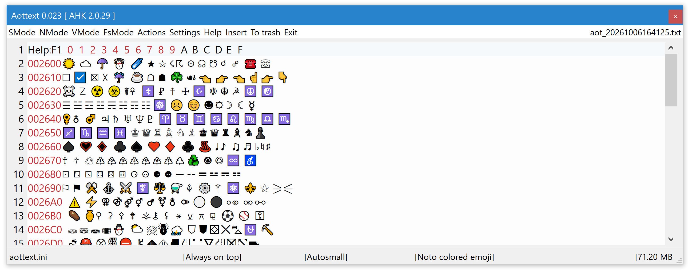

# Aottext   
 
### Status of version 2:  
usable  

**Minimal length of text is a Newline!**  
If there is none, a newline is automatically inserted!  

Screenshot of Aottext with font "Noto colored emoji":  
  
Content are "Dingbats" Unicode characters displayed with: [UnicodeTable](https://github.com/jvr-ks/UnicodeTable)  
  
#### Latest changes:  
Version (&gt;=) | Change  
------------ | -------------  
0.032 | Action -> WinMerge support added
0.029 | New file navigation buttons  
0.026 | Historie buttons, menu chances, bug fixes
0.023 | Fullscreen mode (FsMode) introduced
0.022 | Shorthelp and Readme opens in local default browser (internal HTML viewer is very slow)  
0.021 | Source code useble with AKH 2.029  

#### File navigation buttons  
Button | Action
------------ | ------------- 
 \|<-  | Backwards to first file
 ⇐    | Backwards 10 steps
 <-  | Backwards 1 steps
 ->  | Fowards 1 steps
 ⇒  | Fowards 10 steps
 ->\| | Fowards to last file
  
#### Known issues / bugs  
Issue / Bug | Type | fixed in version  
------------ | ------------- | -------------  
~Shorthelp takes time to open)~ | issue | 0.023  
~Introduced a positioning bug (NMode positioning check)~ | bug | 0.010  
~Files must at least contain one newline!~ | Scintilla issue | 0.008 (Aottext auto adds a newline)  
  
  
#### Description  
A "one sticky note" staying **always on top** (aot) (Windows &gt; 10, 64 bit only).  
- can show the content in 4 different window positions:
- - normal mode: at the bottom of the screen,  
- - vertical mode: on the right side vertically oriented,  
- - small mode: on the left side screen bottom with reduced heigth,  
returns to normal mode if the mouse is moved over the editarea,
- - fullsize mode: Instead of using the default Windows fullscreen icon, which is suppressed! \*1)
- takes less spaces on the desktop,  
- autosaves if content is changed \*2), always to a new file,  
- manual save (tagging) possible ("Save"-button),  
- history function (Shift-key + mousewheel),  
- zoom with Ctrl + mousewheel (default FontSize is defined in the Configurationfile: "guiMainEditFontSize").   
  
All content is kept in memory, so not suitable for very large files.  
Aottext is excluded from the tasklist (if "Autosmall" is enabled).  
- File Read/Write:  
There is no File Read/Write function. Import content via the clipboard!  
Content is saved to
  
\*1) Otherwise, you might accidentally change the window size, which would then be saved as the current mode size/position!  
\*2) Content is saved if it was changed and:  
* on any "hide"-operation,  
* on exiting the app.  
* by pressing the "Save"-button.  
The "Save"-button saves the content regardless of whether it has been changed or not!   
The filename is generated from the current time with a resolution of one second.  
Do not press the "Save"-button more than once in less than a second, 
or you'll get an error-message then!  
Make sure that the date/time of your computer have the correct values.  
    
#### Aottext usage  
  
Key / Button | Operation | Remarks  
------------ | ------------- | -------------  
\[Shift] + \[Mouswheel] | content history  | browse through all files, or use <- -> buttons    
\[SMode] button | "small" position | alternative: \[ALT] + \[a] -> hide/show  
\[NMode] button | "normal" position |  
\[VMode] button | "vertical" position |  
\[FsMode] button | "fullscreen" position |  
\[Exit] button | close the app (content is auto-saved) and reopen it later. :-)  
\[Mouseover] edit field | return to "NMode" | if "SMode" is active only  
  
#### Changeable global hotkeys  
*\[ALT] + \[a]* 
Hide/Show Aottext.  
Set: Configurationfile -&gt; \[config] -&gt; aottextHotkey="!a"  

#### Not changeable global Hotkeys (hardcoded)  
* Mode: normal mode  
* VMode: vertical mode  
* FsMode: fullscreen mode  
* SMode: small mode (transparent)  
  
Position and dimension of each mode is memorized.  
  
Key | Operation | other mode active  
------------ | ------------- | ------------- 
\[Alt] + \[Right mouse button] | VMode <-> NMode | -> VMode
\[Left Shift] + \[Right mouse button] | SMode <-> NMode | -> SMode
\[Windows key (left)] + \[Right mouse button] | FsMode <-> NMode | -> FsMode
\[Ctrl] + \[Right mouse button] | context menu | supplied by Scintilla  
\[Ctrl] + \[Mouse-wheel] | Zoom in/out | supplied by Scintilla (size is not memorized!)  
       
[Overview of all default changable Hotkeys used by my Autohotkey "tools"](https://github.com/jvr-ks/aottext/blob/main/hotkeys.md)  
    
#### Hide the Aottext window: Autosmall  
If "Op"  -&gt; "Settings" -&gt; "Autosmall" is selected,  
the Aottext-window is automatically moved/resized to the "SMode"-position,    
if it is **out of focuss**.  
  
#### Enable Unicode UTF-8  
To use the full Unicode characterset, enable UTF-8 support in Windows:  
[Enable Unicode UTF-8 (Windows 10)](https://www.jvr.de/2022/07/30/unicode-in-console-windows-10-en_us/)

#### File history  
Inspecting all existing files in the "_saved"-directory by using Shift + Mousewheel Up/Down,  
independent of the mouseposition on the screen!  
Any changes made are always written to a **new** file!  
  
#### File Encoding  
UTF-8 BOM  (besides "*.ini" files)  
  
#### Autosave  
Any changes made are always written automatically to a **new** file!,  
if Shift + Mousewheel is used or when Aottext is exiting.  
The "Save"-button does this immediatedly, even if the content has not changed, 
but always to a new file! 
  
#### Line wrapping  
To switch off line wrapping, each mode has a wrap configuration of its own, "Settings" ➝ "NoWrapNMode" etc. (especially useful in the VMode).  
  
#### reActivate Window  
Sometimes the operating system takes away the focus of Aottext (Titlebar changes the color).  
If the mouse is moved over the Aottext text edit field (not the title-bar),  
the focus is reactivated to Aottext.    
  
#### Menu button "ToTrash"  
Immediately moves the actual selected file to the "_trash" subdirectory,  
without any confirmation request.  
  
#### Menu button "Insert"  
The file insertUnicodeFile (default is "insertUnicode.txt" as defined in the Configuration file) contains name \| value pairs (characters to insert into the text).  
If an entry is selected, it is copied to the clipboard.  
If you did not change the file name in the Configuration file and the project "Unicodetable" is installed (located)  
in the sibling directory "..\unicodetable",  
the file "..\unicodetable\insertUnicode.txt" is used instead.  
This way Aottext uses the list made with "Unicodetable.exe".  
   
#### Fonts  
The font used in the text is selectable ("Setting" → "Font of text").  
At the top of the font list are some prefered fonts, change them by editing the configuration file  
section "[preferredFonts]",  
entries (example):  
preferredFont1="Consolas" \*1)  
preferredFont2="Noto colored emoji"  
preferredFont3="OCR-A BT"  
...  
up to 9  
  
Other selectable fonts are the ones installed on your system.  
  
The selected font and size are saved in the Configurationfile →; \[config] guiMainEditFontName="Consolas"  
and Configurationfile → \[config] guiMainEditFontSize=10  
  
The menu is using Windows menus, changing the font would change the font of all other apps (menus) too!  
  
\*1) Drawback of the "Consolas" font is its ugly Smiley character: "☺" should be: &#128522;
  
#### Configuration file  
(**Changed from version >= 0.015**)  

The Configuration file is "aottext.ini".  
(For development and test purposes the file "_aottext.ini" may be use, which takes precedence).  
  
There are two menu-buttons to edit the Configurationfile:  
"Menu" -&gt; "Op" -&gt; "Settings" -&gt; "Edit Config"  
"Menu" -&gt; "Op" -&gt; "Settings" -&gt; "Edit Config (external editor)"  
  
#### Startparameter  
- **hidewindow**, if the app is started with windows, this parameter hides the app-window upon the windows start,  
  use the hotkey to open the app then.  
- **remove**, removes "aottext.exe" from memory.  
  
#### Start installation / update:  
* Run "updater.exe", example: "C:\jvrks\aottext\updater.exe" once to download/update aottext.  
(Menu -&gt; Op -&gt; Update -&gt; Start updater)  
* Then start "aottext.exe", example: "C:\jvrks\aottext\aottext.exe" !  
* Create a desktop-icon and/or a taskbar entry.  
Hint: **To create a taskbar entry, "Autosmall" must be switched off temporarily (Menu -&gt; Op -&gt; Settings -&gt; Autosmall)**  
("Autosmall" does not hide the window but activates the small mode!)  
  
#### First start onetime layout finetune:  
The default layout looks like this (FsMode/Fullscreen not shown):  
```
                                                                                   VMode   
                                                                                   ┌──────┐
                                                                                   │      │
                                                                                   │      │
                                                                                   │      │
                                                                                   │      │
                                                                                   │      │
                                                                                   │      │
                                                                                   │      │
                                                                                   │      │
                                                                                   │      │
                                                                                   │      │
                                                                                   │      │
                                                                                   │      │
                                                                                   │      │
                                                                                   │      │
                                                                                   │      │
                                                                                   │      │
                                                                                   │      │
                                                                                   │      │
                                                                                   │      │
                                                                                   │      │
                                              NMode                                │      │
                                             ┌───────────────────┐                 │      │
                                             │                   │                 │      │
                                             │                   │                 │      │
                                             │                   │                 │      │
                                             │                   │                 │      │
 SMode                                       │                   │                 │      │
┌───────────────────────────┐                │                   │                 └──────┘
└───────────────────────────┘                └───────────────────┘                         
  
```
Please resize / reposition the window in each position ("NMode", "VMode" and "SMode") once. 
  
#### Download  
Via "Updater" is the preferred method!  
Portable, run from any directory, but running from a subdirectory of the windows programm-directories   
(C:\Program Files, C:\Program Files (x86) etc.)  
requires admin-rights and is not recommended!  
**Installation-directory (is created by the Updater) must be writable by the app!**  
  
To download **aottext.exe** 64 bit Windows from Github please use:  
  
[updater.exe 64bit](https://github.com/jvr-ks/aottext/raw/main/updater.exe)  
  
(Updater viruscheck please look at the [Updater repository](https://github.com/jvr-ks/updater)) 
  
* From time to time there are some false positiv virus detections  
[Virusscan](#virusscan) at Virustotal see below.  
  
#### Sourcecode 
[Sourcecode at Github](https://github.com/jvr-ks/aottext), "aottext.ahk" an [Autohotkey](https://www.autohotkey.com) script.  
Uses the [Scintilla](https://www.scintilla.org/) Textcontrol (Scintilla.dll).  
Block move with tab: Indentation is 2 spaces (fixed). 
Made with Autohotkey version 2.0.9 ...  
  
#### License: GNU GENERAL PUBLIC LICENSE 
Please take a look at the file "license.txt"!   
  
Copyright (c) 2020 J. v. Roos  
  
#### License for Lexilla, Scintilla, and SciTE  
  
Copyright 1998-2021 by Neil Hodgson <neilh@scintilla.org>  
  
All Rights Reserved  
  
Permission to use, copy, modify, and distribute this software and its  
documentation for any purpose and without fee is hereby granted,  
provided that the above copyright notice appear in all copies and that  
both that copyright notice and this permission notice appear in  
supporting documentation.  
  
NEIL HODGSON DISCLAIMS ALL WARRANTIES WITH REGARD TO THIS  
SOFTWARE, INCLUDING ALL IMPLIED WARRANTIES OF MERCHANTABILITY  
AND FITNESS, IN NO EVENT SHALL NEIL HODGSON BE LIABLE FOR ANY  
SPECIAL, INDIRECT OR CONSEQUENTIAL DAMAGES OR ANY DAMAGES  
WHATSOEVER RESULTING FROM LOSS OF USE, DATA OR PROFITS,  
WHETHER IN AN ACTION OF CONTRACT, NEGLIGENCE OR OTHER  
TORTIOUS ACTION, ARISING OUT OF OR IN CONNECTION WITH THE USE  
OR PERFORMANCE OF THIS SOFTWARE.  
  
Other parts License  
"SCI.ahk" from:  
https://github.com/RaptorX/scintilla-wrapper  
Copyright by Isaias Baez  
Has no License information!  
  
<a name="virusscan">  


##### Virusscan at Virustotal 
[Virusscan at Virustotal, aottext.exe 64bit-exe, Check here](https://www.virustotal.com/gui/url/c44ffbba37e4b31eb4a11ff3a8235bfb66f64292c3749d6195ba38c8e2b42346/detection/u-c44ffbba37e4b31eb4a11ff3a8235bfb66f64292c3749d6195ba38c8e2b42346-1791662167
)  
